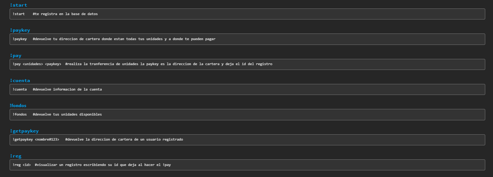
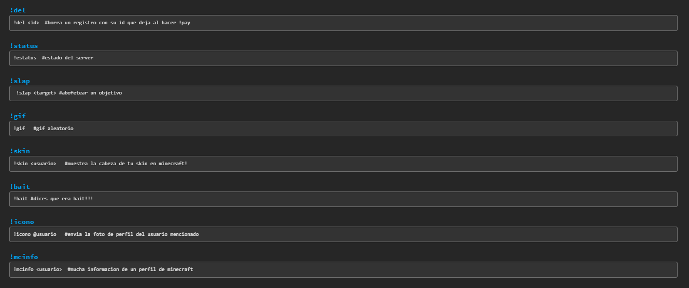
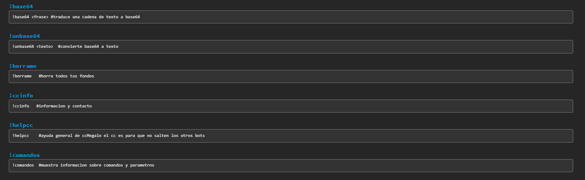

# public-ccMegalo
Discord Bot se puede entender de una version mejorada de [ccunits](https://github.com/scyth3-c/bot-public-ccunits) pero con nuevos comandos y interfaz mejorada, que fuera de la que era su funcion principal, el sistema financiero multi-servidor cuenta con otras utilidades que creceran con el tiempo.

## comandos

en las siguientes imagenes se presentan los comandos del bot y su respectiva explicacion.

parte 1

parte 2 

parte 3

link para agregar el bot a su servidor haga [click aqui](https://discord.com/api/oauth2/authorize?client_id=832815877266997248&permissions=0&scope=bot)

